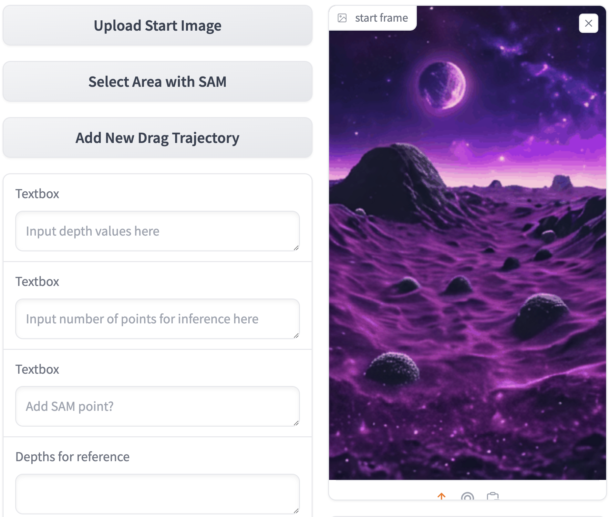
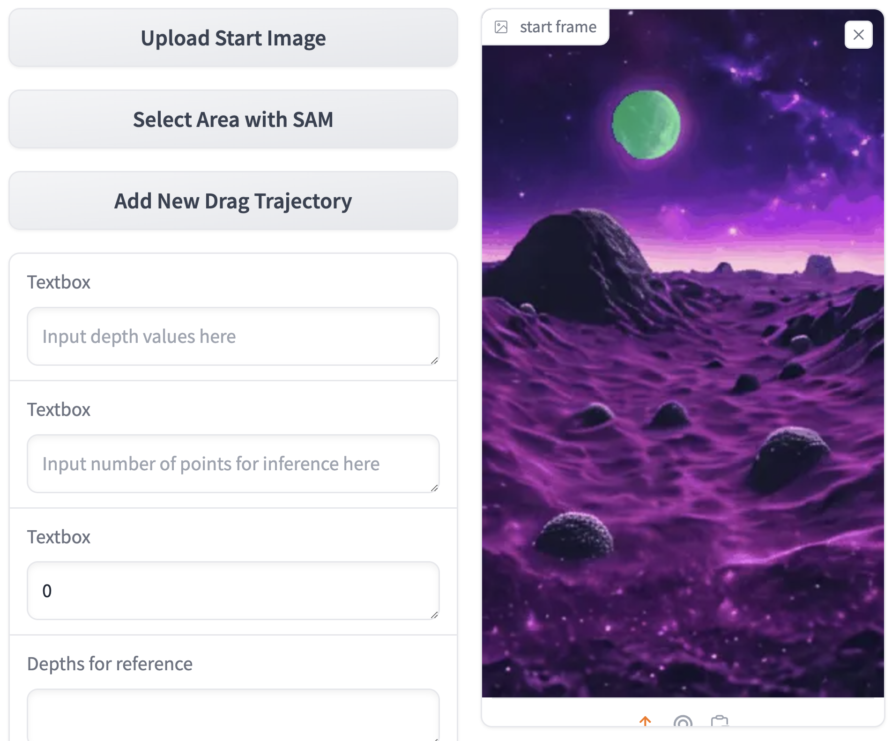
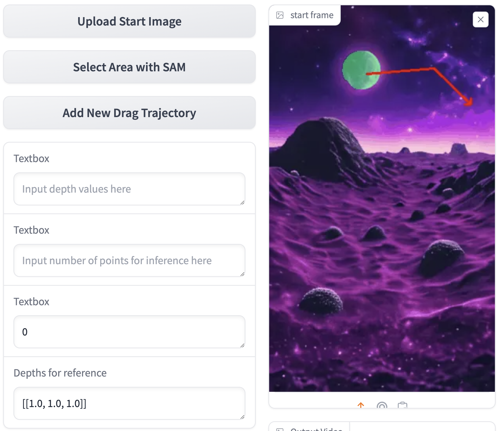
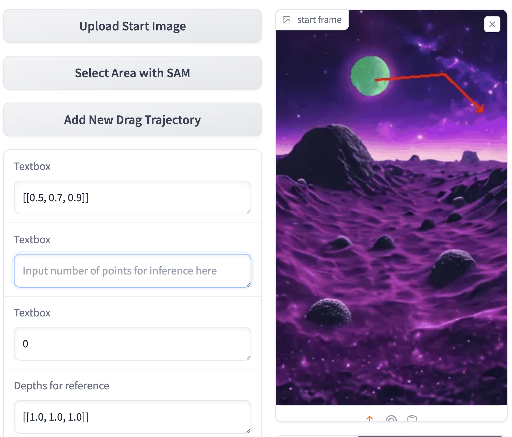
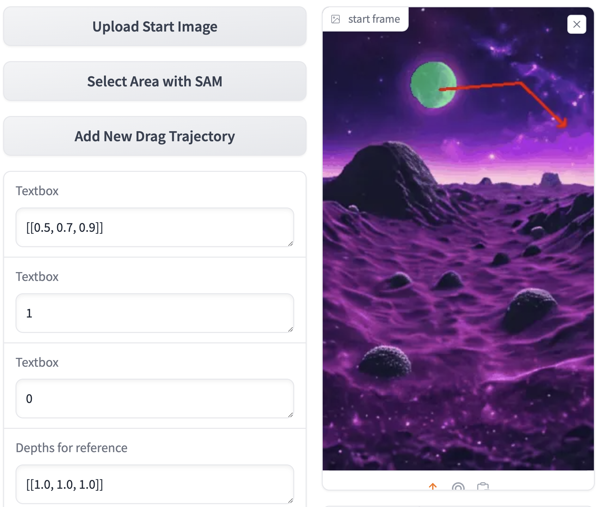
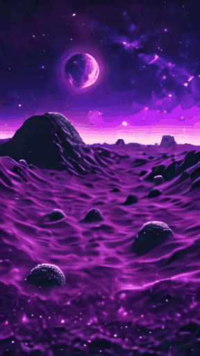
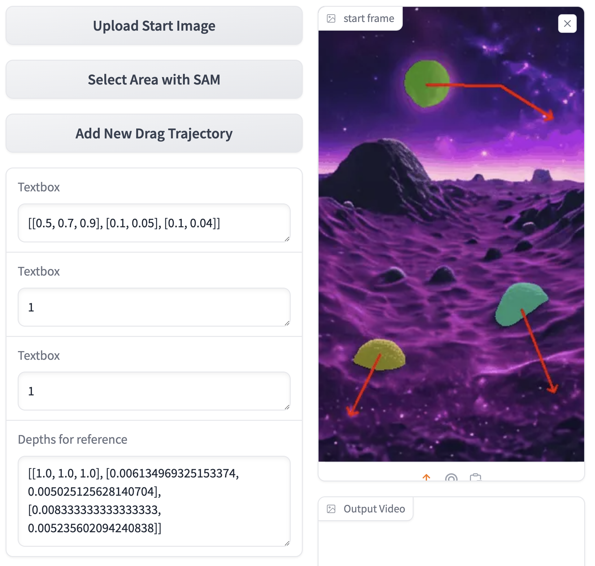
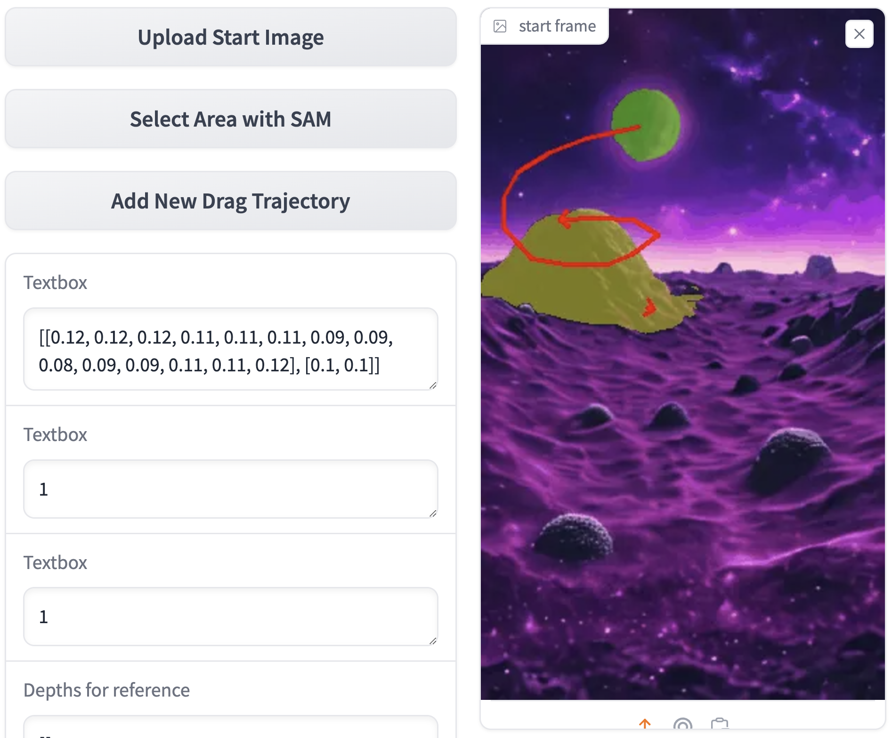

# LeviTor: 3D Trajectory Oriented Image-to-Video Synthesis
<a href="https://ppetrichor.github.io/levitor.github.io/"></a>
<a href="https://arxiv.org/abs/2412.15214"></a>
<a href="https://huggingface.co/hlwang06/LeviTor/tree/main"></a>
<a href="http://www.apache.org/licenses/LICENSE-2.0"></a>

[Hanlin Wang](https://scholar.google.com/citations?user=0uO4fzkAAAAJ&hl=zh-CN)<sup>1,2</sup>, [Hao Ouyang](https://ken-ouyang.github.io/)<sup>2</sup>, [Qiuyu Wang](https://scholar.google.com/citations?user=VRsy9v8AAAAJ)<sup>2</sup>, [Wen Wang](https://github.com/encounter1997)<sup>3,2</sup>, [Ka Leong Cheng](https://felixcheng97.github.io/)<sup>4,2</sup>, [Qifeng Chen](https://cqf.io/)<sup>4</sup>,  [Yujun Shen](https://shenyujun.github.io/)<sup>2</sup>, [Limin Wang](https://wanglimin.github.io/)<sup>†,1</sup><br>
<sup>1</sup>State Key Laboratory for Novel Software Technology, Nanjing University<br> <sup>2</sup>Ant Group <sup>3</sup>Zhejiang University <sup>4</sup>The Hong Kong University of Science and Technology <sup> <br><sup>†</sup>corresponding author

- [LeviTor: 3D Trajectory Oriented Image-to-Video Synthesis](#levitor-3d-trajectory-oriented-image-to-video-synthesis)
  - [TODO List](#todo-list)
  - [Update Log](#update-log)
  - [Setup](#setup)
  - [Acknowledgement](#acknowledgement)
  - [Note](#note)

## TODO List
- [ ] Release gradio demo on huggingface.

## Update Log

- [2024.12.20] 🎉 Exciting News: Interactive demo with gradio for LeviTor has been released!

##  Setup
Follow the following guide to set up the environment.

1. Git clone repo
    ```
    git clone https://github.com/qiuyu96/LeviTor.git
    cd LeviTor
    ```
2. Download and unzip checkpoints
   <br>
   Creat `checkpoints` dir:
   ```
    mkdir checkpoints
    cd checkpoints
    ```
   Download 'depth_anything_v2_vitl.pth' from [Depth Anything V2](https://github.com/DepthAnything/Depth-Anything-V2)
   <br>
   Download 'sam_vit_h_4b8939.pth' from [Segment Anything](https://github.com/facebookresearch/segment-anything)
   <br>
   Download 'stable-video-diffusion-img2vid-xt' from [stabilityai](https://huggingface.co/stabilityai/stable-video-diffusion-img2vid-xt/tree/main)
   <br>
   Create LeviTor checkpoint directory:
    ```
    mkdir LeviTor
    cd LeviTor
    ```
   Then download LeviTor checkpoint from [LeviTor](https://huggingface.co/hlwang06/LeviTor/tree/main)
    
   Ensure all the checkpoints are in the `checkpoints` directory as:
   ```
   checkpoints/
    |-- sam_vit_h_4b8939.pth
    |-- depth_anything_v2_vitl.pth
    |-- stable-video-diffusion-img2vid-xt/
    |-- LeviTor/
        |-- random_states_0.pkl
        |-- scaler.pt
        |-- scheduler.bin
        |-- controlnet/
        |-- unet/
   ```
   


3. Create environment
    ```
    conda create -n LeviTor python=3.9 -y
    conda activate LeviTor
    ```

4. Install packages
    ```
    pip install -r requirements.txt
    ```

5. Install pytorch3d
    ```
    pip install "git+https://github.com/facebookresearch/pytorch3d.git"
    ```

6. Install gradio
    ```
    pip install gradio==4.36.1
    ```

7. run LeviTor
    ```
    python gradio_demo/gradio_run.py --frame_interval 1 --num_frames 16 --pretrained_model_name_or_path checkpoints/stable-video-diffusion-img2vid-xt --resume_from_checkpoint checkpoints/LeviTor --width 288 --height 512 --seed 217113 --mixed_precision fp16 --enable_xformers_memory_efficient_attention --output_dir ./outputs --gaussian_r 10 --sam_path checkpoints/sam_vit_h_4b8939.pth --depthanything_path checkpoints/depth_anything_v2_vitl.pth
    ```

## Tutorial

Please read before you try!

<!DOCTYPE html>
<html>
<body>
<div class="tutorial"><div><h3 align="center" class="heading">I. Upload the start image</h3><div align="center"></div><div align="center"><br>Use the <b>Upload Start Image</b> to upload your image~<br></div>
<hr>
<h3 align="center" class="heading">II. Select the area you want to operate</h3><div align="center"></div><div align="center">Click <b>Select Area with SAM</b> button and then click on the image to select the area you want to operate with SAM.<br>Note that if the current point you click on the image is <b>in</b> your interested area, input <b>1</b> in the <b>Add SAM Point?</b> box. Otherwise, input <b>0</b> to click a point in your uninterested area. Use the <b>Add SAM Point?</b> box to accurately selected the area you want. </div>
<hr>
<h3 align="center" class="heading">III. Draw a 3D trajectory and run!</h3><div align="center"><br></div><div align="center">Click the <b>Add New Drag Trajectory</b> button to draw a 2D trajectory by clicking a series of points. Then you can see the depth values of your clicked points in the <b>Depths for reference</b> box. You can refer to this to determine your later input depth values.<br></div>

<div align="center"><br></div><div align="center">Then in the <b>Input depth values here</b> box, input your depth control values. All the depth values should be normalized to the range of 0 to 1. The smaller value is, the nearer the area moves. The number of input depth values input should be the same with values in <b>Depths for reference</b> box. Note that the depth values you input is relative depth, so the depths do not matter, but the changes of depth values determine how near or how far the object moves.<br></div>

<div align="center"><br></div><div align="center">After that, input a ratio value in the <b>Input number of points for inference here</b> to select how many control points will be used for inference. A small ratio is beneficial for non-rigid body motion, while a large ratio is suitable for rigid body motion.<br></div>

<div align="center"><br></div><div align="center">Finally, click the <b>Run</b> button to generate you video!<br></div>

<hr>
<h3 align="center" class="heading">IV. Others</h3><div align="center"><br></div><div align="center">You can also draw multiple trajectories to generate your video.<br></div>

<div align="center"><br></div><div align="center">To generate some orbiting effects, one suggestion is to select a reference object and create a primarily stationary path for it. This allows you to set a relative depth value, making it easier to adjust the depth changes for objects orbiting around it. For example, in the image above, we set the mountain depth value to 0.1. Then, based on the position of the points, we adjust the planetary depth variation. A value greater than 0.1 indicates that the object is behind the mountain, while a value less than 0.1 indicates that it has moved in front of the mountain, achieving a surrounding effect.<br></div>
</body>
</html>

## Citation
Don't forget to cite this source if it proves useful in your research!
```bibtex
@article{wang2024levitor, 
	title={LeviTor: 3D Trajectory Oriented Image-to-Video Synthesis}, 
	author={Hanlin Wang and Hao Ouyang and Qiuyu Wang and Wen Wang and Ka Leong Cheng and Qifeng Chen and Yujun Shen and Limin Wang}, 
	year={2024}, 
	eprint={2412.15214}, 
	archivePrefix={arXiv}, 
	primaryClass={cs.CV}}
```

## Acknowledgement
Our implementation is based on 
- [Framer](https://github.com/aim-uofa/Framer)
- [DragAnything](https://github.com/showlab/DragAnything)
- [Segment Anything](https://github.com/facebookresearch/segment-anything)
- [Depth Anything V2](https://github.com/DepthAnything/Depth-Anything-V2)
- [SVD Xtend](https://github.com/pixeli99/SVD_Xtend)
- [CoTracker](https://github.com/facebookresearch/co-tracker)

Thanks for their remarkable contribution and released code!

## Note
Note: This repo is governed by the license of Apache 2.0 We strongly advise users not to knowingly generate or allow others to knowingly generate harmful content, including hate speech, violence, pornography, deception, etc. 

(注：本仓库受Apache 2.0的许可协议限制。我们强烈建议，用户不应传播及不应允许他人传播以下内容，包括但不限于仇恨言论、暴力、色情、欺诈相关的有害信息。)